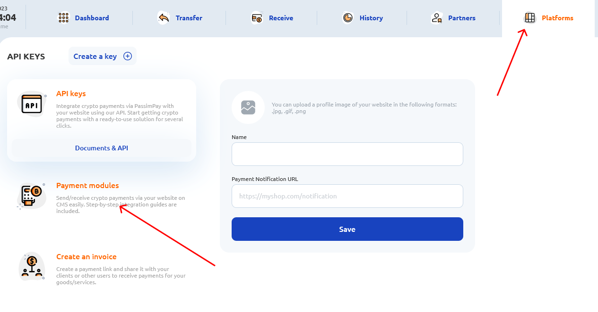

##Модуль оплаты через платежный шлюз "Passimpay"

Модуль предназначен для PHPShop 6.x Pro/Enterprise

###ИСТРУКЦИЯ ПО УСТАНОВКЕ

1. Зарегистрируйтесь на сайте https://passimpay.io/register.
2. Добавьте ваш проект в личном кабинете:
   [](passimpay-platforms.png)
3. Укажите страницу успешной оплаты на сайте
   Успешный URL: https://example.com/success/?payment=passimpay
4. Укажите страницу неудачной оплаты на сайте
   Неудачный URL: https://example.com/fail/
5. URL для уведомлений: https://example.com/payment/passimpay/result.php
6. Распаковать архив, и закачать файлы модуля (папки `payment` и `UserFiles`) на сервер в корневую директорию, заменяя имеющиеся файлы на сервере.
7. Заходим в админ панель вашего сайта (https://example.com/phpshop/admpanel/), переходим в раздел "Заказы" ➝ "Способы оплаты".
8. Создать новый способ оплаты, нажав на "+" вверху списка.
9. Включить данный вид оплаты, и нажать на шестеренку для настройки. Заполнить название, выбрать в пункте "Тип подключения" - `Оплата passimpay`. Выбрать логотип (по желанию) на сервере, он поставляется вместе с модулем и уже загружен в нужную папку, поэтому у вас появится список с лого платежных систем, найдите среди них `passimpay_logo.png`. Нажмите загрузить.
10. В разделе сообщение после заказа необходимо заполнить заголовок и поле сообщения об успешной оплате через Passimpay!
11. Далее нужно зайти на сервере в папку `/phpshop/inc/config.ini` Открыть его редактором.
12. Далее скопировать туда следующий кусок кода:
```
[passimpay]
secret_key = "111111-222222-333333-44444-55555";
platform_id = "111";
```
Заполнить своими данными и сохранить файл.
* "secret_key" и "platform_id" получаем по инструкции https://passimpay.io/developers (потребуется регистрация).
13. Не забыть настроить актуальный курс доллара, т.к. Passimpay работает в USD! Для этого в админ панели перейти сверху в "Настройки" ➝ "Валюты" ➝ "Доллар". Указать актуальный курс.
14. Модуль готов к работе. Успешных платежей!
