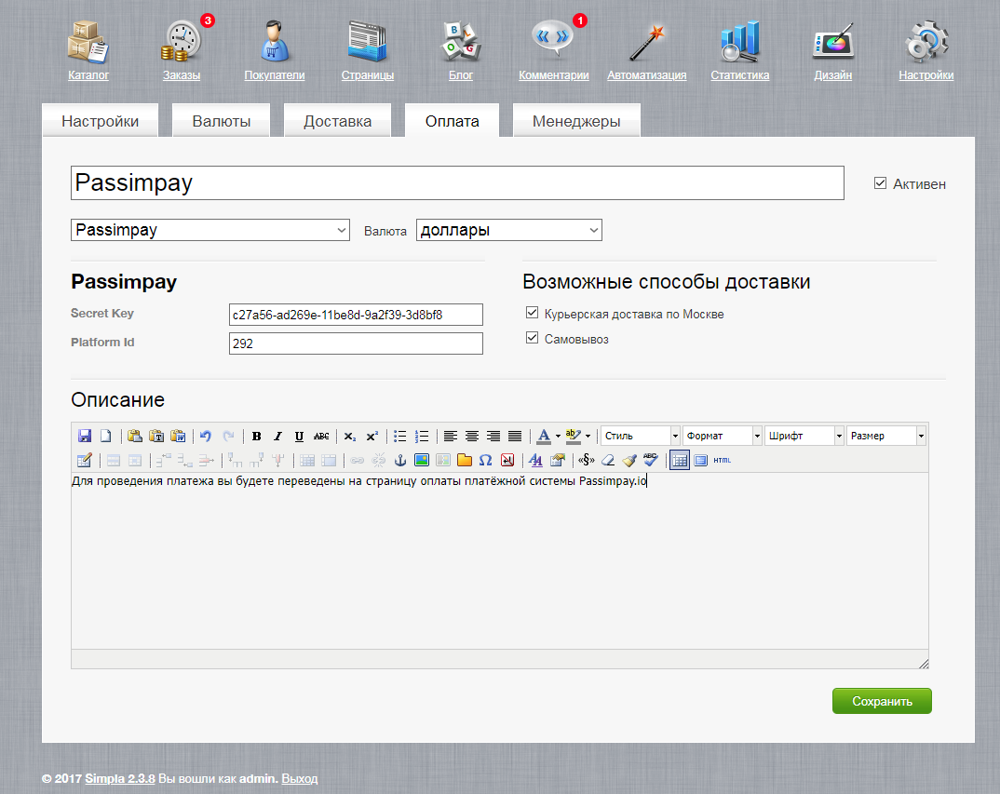

### Как интегрировать плагин для Simpla CMS

<i>Модуль предназначен для SimplaCMS 2.3</i>

1. Зарегистрируйтесь на сайте https://passimpay.io/register.
2. Добавьте ваш проект в личном кабинете:
    
3. Укажите страницу успешной оплаты на сайте
   
   Успешный URL: https://example.com/order
4. Создайте страницу неудачной оплаты на сайте и укажите адрес

   Неудачный URL: https://example.com/fail (can be any link)
5. URL для уведомлений: https://example.com/payment/Passimpay/callback.php
6. Скопировать папку `Passimpay` в директорию /`payment/` сайта (через FTP).
7. Зайти в админпанель по адресу `http://example.com/simpla/index.php`.
8. Перейти в «Настройки» ➝ «Оплата» ➝ «Добавить способ оплаты».
9. * Ввести название "Passimpay" и рядом поставить галочку "Активен";
    * В выпадающем списке выбрать "Passimpay" и рядом в соседнем списке "Валюта" -> "доллары".
      (Если нет такой, добавляем в настройках магазина). 
10. В настройках устанавливаем "Secret Key" и "Platform Id":
    (Для получения "Secret key" и "Platform Id" перейдите в раздел “Настройки проекта” в личном кабинете passimpay.io)
    
11. Обязательно включите все доступные способы доставки.
12. Дайте описание данному методу оплаты, например: (Для проведения платежа в криптовалюте вы будете переведены на страницу оплаты платёжной системы Passimpay.io)
13. Не забудьте настроить актуальный курс доллара, т.к. Passimpay работает в USD! Для этого в админ панели перейдите в "Настройки" ➝ "Валюты" ➝ "Доллар". Указать актуальный курс.